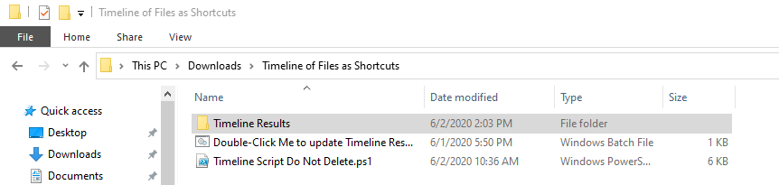
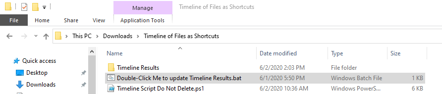
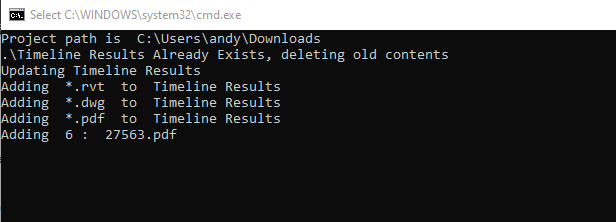
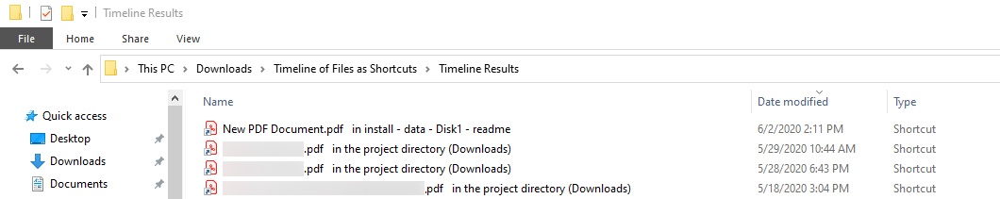

# Timeline of Files as Shortcuts
This is a Windows 10 PowerShell script (and accompanying double-click-to-run .bat file). It creates a folder of shortcuts of files, named "Timeline Results", in a folder tree, using the target files' datestamps. You can see (and access) files across an entire folder tree, ordered by date and time. It was created to allow for time-based review of a project folder, so you can see the chronology of all files in the project at a glance.

# Installation
1. Copy the entire "Timeline of Files as Shortcuts" directory into the root directory that you want to create a timeline for. For example, if you wanted the timeline of your Downloads folder, after copying in the "Timeline of Files as Shortcuts" directory, you should see this:



2. Edit the lines in the script (```Timeline of Files as Shortcuts/Timeline Script Do Not Delete.ps1```) that define which file extensions you want to include in the timeline. The default values are .RVTs, .DWGs, and .PDFs (guess what industry this was created for?), but you can use any list of extensions. The script runs strangely fast or slow, apparently depending on whether it has been previously run (?). There's maybe something about the creation of shortcuts that is slow the first time and faster later, or something (I haven't investigated). So, limiting the file extensions to the ones you care about can make the script run a _lot_ faster. This is what the top of the script file looks like. You can add or remove lines where ```"*.rvt",``` and ```"*.dwg",``` are: 
```
# You can add/remove file extensions to be searched for here.
# Make sure you use * wildcards to indicate that you want ALL of
# that type of file to be included in the timeline.
# Comma-separate them, and make sure there's no comma after the last one.
$fileTypesToInclude = @(


"*.rvt",
"*.dwg",


# Add file types ABOVE this line, in quotes, using a *,
# and ending with a comma. Every time. Don't mess that up
# or the script won't run.


# If you want to stop including PDFs in the timeline,
# you can delete the next line, but make sure that whatever
# file type is listed last does NOT have a comma after it,
# or the script won't run.
"*.pdf"
)
```
# Usage
Double-click the "Double-Click Me to update Timeline Results.bat" file.




It'll run, looking like this, and showing updated file count progress as it goes:




And when it's done, the "Timeline Results" folder will contain a shortcut to every file in the folder tree, but the shortcut name will include a path to the folder it comes from, so that it's easier to see at a glance what was updated and _where_. For example, the file "New PDF Document.PDF" shortcut shows that the file is located in the `install - data - Disk 1 - readme` subfolder of Downloads, but the other documents shown in the example are in the Downloads folder itself (called the "project directory" by the script). Like this:


